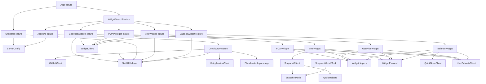

```mermaid
graph TD;
    AppFeature-->WidgetSearchFeature;
    AppFeature-->OnboardFeature;
    WidgetSearchFeature-->AccountFeature;
    WidgetSearchFeature-->BalanceWidgetFeature;
    WidgetSearchFeature-->VoteWidgetFeature;
    WidgetSearchFeature-->POAPWidgetFeature;
    WidgetSearchFeature-->GasPriceWidgetFeature;
    AccountFeature-->ServerConfig;
    AccountFeature-->ContributorFeature;
    ContributorFeature-->GitHubClient;
    ContributorFeature-->SwiftUIHelpers;
    ContributorFeature-->UIApplicationClient;
    ContributorFeature-->PlaceholderAsyncImage;
    BalanceWidgetFeature-->WidgetClient;
    BalanceWidgetFeature-->BalanceWidget;
    BalanceWidgetFeature-->SwiftUIHelpers;
    VoteWidgetFeature-->VoteWidget;
    VoteWidgetFeature-->WidgetClient;
    VoteWidgetFeature-->SwiftUIHelpers;
    OnboardFeature-->ServerConfig;
    OnboardFeature-->SwiftUIHelpers;
    POAPWidgetFeature-->POAPWidget;
    POAPWidgetFeature-->WidgetClient;
    POAPWidgetFeature-->SwiftUIHelpers;
    GasPriceWidgetFeature-->WidgetClient;
    GasPriceWidgetFeature-->SwiftUIHelpers;
    GasPriceWidgetFeature-->GasPriceWidget;
    SnapshotModelMock-->SnapshotModel;
    SnapshotClient-->ApolloHelpers;
    SnapshotClient-->SnapshotModel;
    BalanceWidget-->WidgetHelpers;
    BalanceWidget-->WidgetProtocol;
    BalanceWidget-->QuickNodeClient;
    BalanceWidget-->UserDefaultsClient;
    VoteWidget-->WidgetHelpers;
    VoteWidget-->WidgetProtocol;
    VoteWidget-->UserDefaultsClient;
    VoteWidget-->SnapshotClient;
    GasPriceWidget-->WidgetHelpers;
    GasPriceWidget-->WidgetProtocol;
    GasPriceWidget-->UserDefaultsClient;
    POAPWidget-->WidgetHelpers;
    POAPWidget-->WidgetProtocol;
    POAPWidget-->UserDefaultsClient;
```