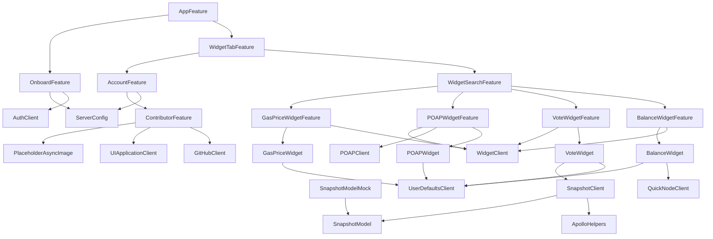

```mermaid
graph TD;
    AppFeature-->WidgetTabFeature;
    AppFeature-->OnboardFeature;
    WidgetSearchFeature-->BalanceWidgetFeature;
    WidgetSearchFeature-->VoteWidgetFeature;
    WidgetSearchFeature-->POAPWidgetFeature;
    WidgetSearchFeature-->GasPriceWidgetFeature;
    AccountFeature-->ServerConfig;
    AccountFeature-->ContributorFeature;
    ContributorFeature-->GitHubClient;
    ContributorFeature-->UIApplicationClient;
    ContributorFeature-->PlaceholderAsyncImage;
    BalanceWidgetFeature-->WidgetClient;
    BalanceWidgetFeature-->BalanceWidget;
    VoteWidgetFeature-->VoteWidget;
    VoteWidgetFeature-->WidgetClient;
    OnboardFeature-->AuthClient;
    OnboardFeature-->ServerConfig;
    POAPWidgetFeature-->POAPWidget;
    POAPWidgetFeature-->POAPClient;
    POAPWidgetFeature-->WidgetClient;
    GasPriceWidgetFeature-->WidgetClient;
    GasPriceWidgetFeature-->GasPriceWidget;
    WidgetTabFeature-->WidgetSearchFeature;
    WidgetTabFeature-->AccountFeature;
    SnapshotModelMock-->SnapshotModel;
    SnapshotClient-->ApolloHelpers;
    SnapshotClient-->SnapshotModel;
    BalanceWidget-->QuickNodeClient;
    BalanceWidget-->UserDefaultsClient;
    VoteWidget-->UserDefaultsClient;
    VoteWidget-->SnapshotClient;
    GasPriceWidget-->UserDefaultsClient;
    POAPWidget-->UserDefaultsClient;
```